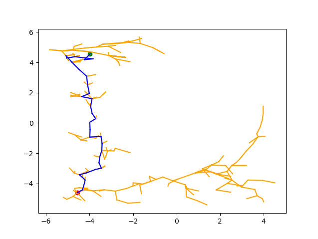
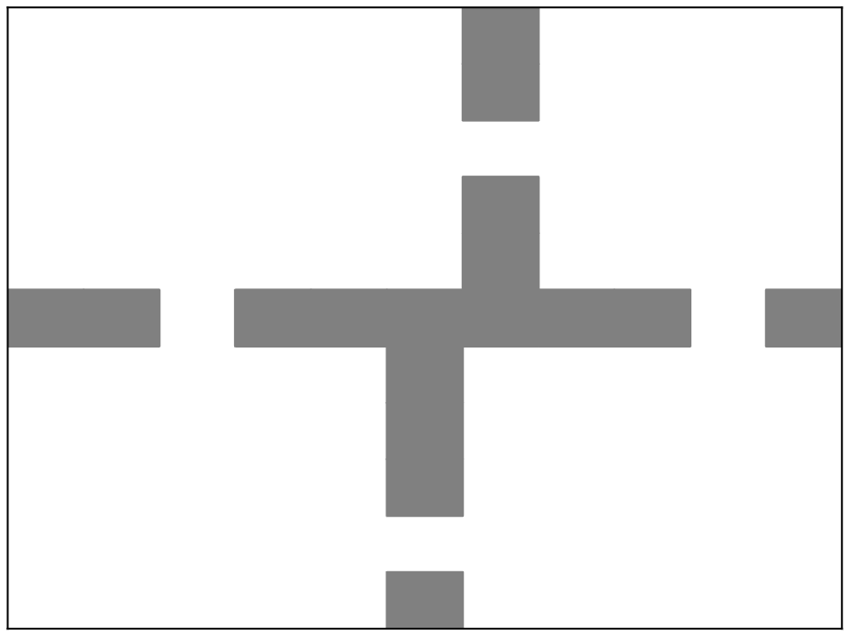

# Rapidly-exploring Random Tree using a Hierarchical Actor-Critic

The repository shares a [write-up of my Fall 2022 Motion-Planning course project](course_writeup.pdf) which code is not refined enough to share yet.

Motivated by work on planning-augmented RL \[[PAHRL](https://ieeexplore.ieee.org/abstract/document/9395248), [SoRB](https://arxiv.org/abs/1906.05253)\], I explored the potential benefit of more fully utilizing a hierarchical RL agent to perform planning. Instead of sampling the state or goal spaces while training, this project attempted to utilize a [Hierarchical Actor Critic](https://github.com/andrew-j-levy/Hierarchical-Actor-Critc-HAC-) to model both the agent and environment dynamics. In doing so, the environment dynamics could be used to expand a Rapidly-exploring Random Tree. The hope was be able to benefit from the improved local accuracy of the lower level agent that prior works highlighted while avoiding the step of sampling. 

Results show a successful transformation of a reactive HAC agent into a planning agent but have did not achieved the desired success rate. 

 

 <b>Figure:</b> To the left is an example of a plan in goal space of a openai gym ant agent. To the right is the maze used for most of these experiments. 
