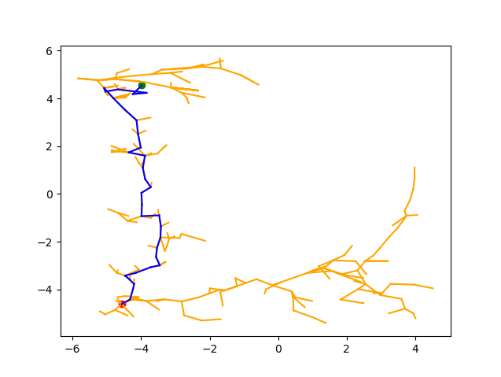

# Rapidly-exploring Random Tree using a Hierarchical Actor-Critic

Motivated by work on planning-augmented RL \[[PAHRL](https://ieeexplore.ieee.org/abstract/document/9395248), [SoRB](https://arxiv.org/abs/1906.05253)\], This project explores the potential benefit of utilizing a hierarchical RL agent for planning. The [Hierarchical Actor Critic](https://github.com/andrew-j-levy/Hierarchical-Actor-Critc-HAC-) is leveraged as a model of both the agent and environment.  The Q-functions are used to expand a Rapidly-exploring Random Tree (RRT) thus presenting us with a model of the environment. The policy is then used to follow a path of highest confidence presented by the RRT. Different levels of the Q-function hierarchy are used to weigh in on the path selection, thus unlocking the benefit of the granular low level Q-functions (shown the left in Figure 2) along all steps of the path planning.

The full [write-up](https://baldeeb.github.io/assets/pdf/hac-rrt-writeup.pdf) can be found on my [webpage](https://baldeeb.github.io/projects/). This work is part of the final project for the [ROB 520 - Motion Planning](https://web.eecs.umich.edu/~dmitryb/courses/winter2022motionplanning/index.html) course. Most of the contributed code resides in the [`rrt` folder](./ant_four_rooms_3_levels/rrt/).

This project and code is based on work by andrew_levy2@brown.edu on the Hierarchical Actor-Critic (HAC) algorithm. For more information on the algorithm, please see the ICLR 2019 [paper](https://openreview.net/pdf?id=ryzECoAcY7) and [blog post](http://bigai.cs.brown.edu/2019/09/03/hac.html). The original README and code is retained in the `ant_four_rooms_3_levels` folder.

Results show a successful transformation of a reactive HAC agent into a planning agent. The algorithm did not achieve the desired success rates with the agent's granularity being suspect.

 

 <b>Figure 1:</b> To the left is an example of a plan in goal space of a openai gym ant agent. To the right is the maze used for most of these experiments. 

Below are more visuals demonstrating the granularity of the agent's hierarchy of Q-values.

 <b>Figure 2:</b> Visual of the hierarchy of Q-values used by the RRT algorithm. The left most is the lowest layer and the right is the highest (initial) layer. 

